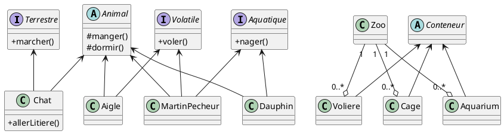

# Zoo

J'ai pas tout à fait respecté le cahier des charges, mais je pense avoir fait mieux ! <3

## Diagramme revisité

Copiez-collez le code ci-dessous sur le site [Planttext](https://planttext.com/).

